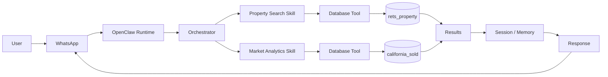

# OpenClaw Architecture

## Overview

OpenClaw receives a user request, routes it to the right skill or agent, uses tools when needed, and sends the result back to the user.

## System Architecture



## Main Components

### Channel

The channel is how the user communicates with OpenClaw.

For this project, the main channel is WhatsApp.

### Runtime

The OpenClaw runtime handles the request while it moves through the system.

It connects things like channels, skills, tools, sessions, and memory.

### Orchestrator

The orchestrator decides where a request should go.

For example:

- A home search goes to the Property Search skill.
- A question about price trends goes to the Market Analytics skill.

### Skill

A skill handles a certain type of task.

Examples for this project:

- Property Search
- Market Analytics
- RAG

### Tool

A tool performs an action for a skill.

For example, a database tool can query MySQL and return property data.

### Session

A session keeps track of the current user's conversation and state.

### Memory

Memory stores information that OpenClaw may need while handling conversations.

This can include short-term session information and longer-term stored information.

## Example Flows

### Property Search

Example:

> Find me a 3 bedroom condo in Irvine.

Flow:

```text
User
 ↓
WhatsApp
 ↓
OpenClaw
 ↓
Property Search Skill
 ↓
Database Tool
 ↓
rets_property
 ↓
Results
 ↓
Response
```

`rets_property` is used for active property/listing information.

### Market Question

Example:

> Are prices increasing in San Diego?

Flow:

```text
User
 ↓
WhatsApp
 ↓
OpenClaw
 ↓
Market Analytics Skill
 ↓
Database Tool
 ↓
california_sold
 ↓
Results
 ↓
Response
```

`california_sold` is used for sold-property data and market analysis.

## OpenClaw Repo

While looking through the OpenClaw source code, some of the main folders that relate to this architecture are:

- `src/agents`
- `src/channels`
- `src/memory`
- `src/plugins`

There are also runtime and configuration files that connect these parts of the system.

The basic idea is that OpenClaw sits between the user's message and the tools/data needed to answer it.
