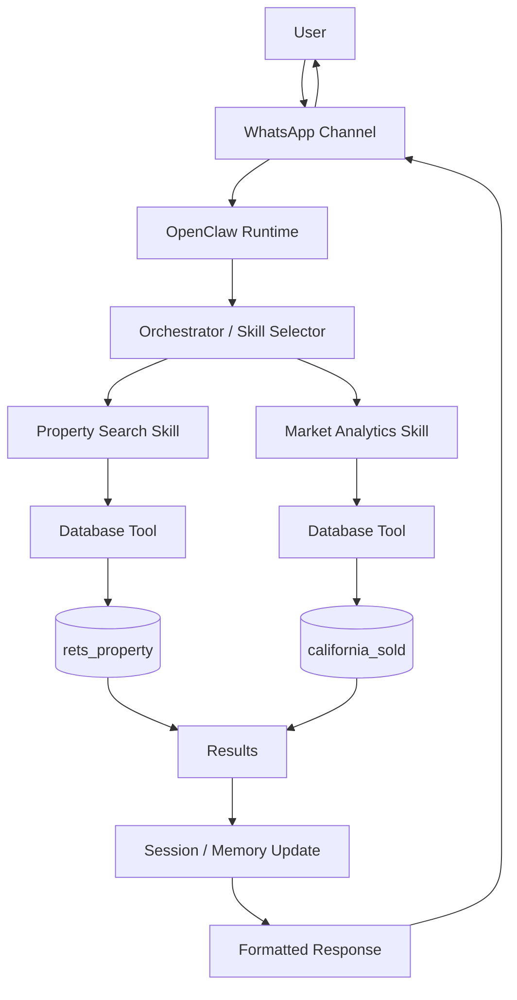

# OpenClaw Architecture

## Overview

OpenClaw is a multi-agent orchestration runtime that handles communication channels, skill routing, session state, memory, and tool execution.

For the IDX Exchange system, a user sends a request through WhatsApp. OpenClaw determines which skill should handle the request, executes the appropriate database tool, updates the user's session or memory, and returns a formatted response.

## System Architecture



## Components

### Channel

The interface used to communicate with OpenClaw.

Example:
- WhatsApp

### Runtime

The main OpenClaw environment that manages incoming requests, skill execution, sessions, tools, and responses.

### Orchestrator

Determines which skill or agent should handle a user's request.

For example, a property search request can be routed to the Property Search Skill, while a question about housing prices can be routed to the Market Analytics Skill.

### Skill

A modular capability that handles a specific type of request.

Examples:
- Property Search
- Market Analytics
- RAG

### Tool

A function that a skill or agent can call to perform an action.

Example:
- Query the MySQL database

### Session

Stores the state and conversation context for an individual user.

### Memory

Stores information that may be needed during or across conversations, including short-term session state and long-term information.

## Database Flow

### Property Search

Example user request:

> "Find me a 3 bedroom condo in Irvine."

The request follows this path:

```text
User
  ↓
WhatsApp
  ↓
OpenClaw Runtime
  ↓
Orchestrator
  ↓
Property Search Skill
  ↓
Database Tool
  ↓
rets_property
  ↓
Results
  ↓
Response to User
```

The `rets_property` database contains property listing information used for property search queries.

### Market Analytics

Example user request:

> "Are prices increasing in San Diego?"

The request follows this path:

```text
User
  ↓
WhatsApp
  ↓
OpenClaw Runtime
  ↓
Orchestrator
  ↓
Market Analytics Skill
  ↓
Database Tool
  ↓
california_sold
  ↓
Results
  ↓
Response to User
```

The `california_sold` database contains sold-property data that can be used for market statistics and trend analysis.

## Summary

OpenClaw acts as the layer between the user and the underlying tools and databases. The orchestrator determines which skill should handle the request, the skill uses the appropriate tool to retrieve data, and OpenClaw returns the result to the user through WhatsApp.
